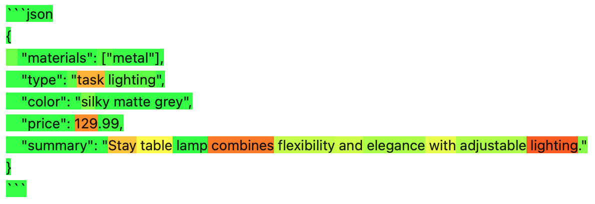

Visualize Token Probabilities and Model Confidence in LLM Predictions
=====================================================================

In this tutorial we show how :func:`eli5.explain_prediction` can be used to
visualize LLM predictions, highlighting tokens proportionally to the log
probability. In many cases, this can help to see where LLM is uncertain
about its predictions:



   LLM token probabilities visualized with eli5.explain_prediction

1. OpenAI models
----------------

To follow this tutorial you need the ``openai`` library installed and
working.

.. code:: ipython3

    import eli5
    import openai
    
    client = openai.OpenAI()

First let’s define our task: we’ll be extracting specific product
properties from a free-form product description:

.. code:: ipython3

    product_description = """\
    Stay is designed by Danish Maria Berntsen and is functional and beautiful lighting
    in one and the same design. Stay has several nice features, where the lamp's flexible
    swivel mechanism makes it possible to direct the light and create optimal lighting
    conditions. Furthermore, the switch is discreetly placed behind the lamp head,
    making it easy and convenient to turn the light on and off. Thus, Stay combines great
    flexibility and elegant appearance in a highly convincing way.
    
    Stay table lamp is highly functional, as the arm and head of the lamp can be adjusted
    according to wishes and needs, which make it ideal as task lighting in the office.
    Furthermore, the silky matte grey metal support the modern and minimalistic expression.\
    """
    prompt = f"""\
    Product description:
    {product_description.strip()}
    
    Extract the following properties from product description:
    'materials' (list of strings),
    'type' (string, e.g. 'LED'),
    'color' (string),
    'price' (non-zero float with 2 decimal places),
    'summary' (string, a very short summary).
    Respond with JSON dict with above keys. Always make sure to return the price or it's estimate.
    """
    completion = client.chat.completions.create(
        messages=[{"role": "user", "content": prompt}],
        model="gpt-4o",
        logprobs=True,
        temperature=0,
    )
    print(completion.choices[0].message.content.strip('`'))


.. parsed-literal::

    json
    {
        "materials": ["metal"],
        "type": "task lighting",
        "color": "silky matte grey",
        "price": 150.00,
        "summary": "Stay table lamp with adjustable arm and head for optimal task lighting."
    }
    


If you examine the prompt and description above, you can see that not
all attributes are equally clear: - “material” is quite clear and
explicitly mentioned - “color” is also clear, but its mention is more
ambiguous - “type” is underspecified, we don’t extractly specify what we
want, - “summary” is quite clear, but there is no single correct
summary, - “price” is not present at all, but we ask a model to make a
guess.

You may have noticed that above we included ``logprobs=True,`` in a call
to the model, this allows us to get a log-probability for each token,
and then we can visualize them with :func:`eli5.explain_prediction`:

.. code:: ipython3

    eli5.explain_prediction(completion)


.. raw:: html

    
        <style>
        table.eli5-weights tr:hover {
            filter: brightness(85%);
        }
    </style>
    
    
    
    
    
    
    
    
    
    
    
    
    
    
    
    
    
    
    
    
    
    
    
    
    
    
    
    
    
    
    
    
        <p style="margin-bottom: 2.5em; margin-top:0; white-space: pre-wrap;"><span style="background-color: hsl(119.23053297772547, 100.00%, 50.00%)" title="1.000">```</span><span style="background-color: hsl(120.0, 100.00%, 50.00%)" title="1.000">json
    </span><span style="background-color: hsl(119.51949481223583, 100.00%, 50.00%)" title="1.000">{
    </span><span style="background-color: hsl(75.78899991196621, 100.00%, 50.00%)" title="0.731">   </span><span style="background-color: hsl(120.0, 100.00%, 50.00%)" title="1.000"> &quot;</span><span style="background-color: hsl(119.85346280886647, 100.00%, 50.00%)" title="1.000">materials</span><span style="background-color: hsl(120.0, 100.00%, 50.00%)" title="1.000">&quot;:</span><span style="background-color: hsl(105.72702811559243, 100.00%, 50.00%)" title="0.982"> [&quot;</span><span style="background-color: hsl(114.65300104107757, 100.00%, 50.00%)" title="0.998">metal</span><span style="background-color: hsl(118.01526747560033, 100.00%, 50.00%)" title="1.000">&quot;],
    </span><span style="background-color: hsl(120.0, 100.00%, 50.00%)" title="1.000">    &quot;</span><span style="background-color: hsl(119.85346280886647, 100.00%, 50.00%)" title="1.000">type</span><span style="background-color: hsl(120.0, 100.00%, 50.00%)" title="1.000">&quot;:</span><span style="background-color: hsl(95.17763749664788, 100.00%, 50.00%)" title="0.930"> &quot;</span><span style="background-color: hsl(55.0925319512844, 100.00%, 50.00%)" title="0.425">table</span><span style="background-color: hsl(117.73803347346254, 100.00%, 50.00%)" title="1.000"> lamp</span><span style="background-color: hsl(118.68795715152754, 100.00%, 50.00%)" title="1.000">&quot;,
    </span><span style="background-color: hsl(120.0, 100.00%, 50.00%)" title="1.000">    &quot;color&quot;: &quot;</span><span style="background-color: hsl(86.00990572824571, 100.00%, 50.00%)" title="0.852">sil</span><span style="background-color: hsl(118.98591880987586, 100.00%, 50.00%)" title="1.000">ky</span><span style="background-color: hsl(119.85346280886647, 100.00%, 50.00%)" title="1.000"> matte</span><span style="background-color: hsl(119.65690466044835, 100.00%, 50.00%)" title="1.000"> grey</span><span style="background-color: hsl(119.70143673685686, 100.00%, 50.00%)" title="1.000">&quot;,
    </span><span style="background-color: hsl(120.0, 100.00%, 50.00%)" title="1.000">    &quot;price&quot;:</span><span style="background-color: hsl(119.67801496649118, 100.00%, 50.00%)" title="1.000"> </span><span style="background-color: hsl(45.447904265487786, 100.00%, 50.00%)" title="0.286">150</span><span style="background-color: hsl(120.0, 100.00%, 50.00%)" title="1.000">.</span><span style="background-color: hsl(118.28903474979332, 100.00%, 50.00%)" title="1.000">00</span><span style="background-color: hsl(111.31769513220767, 100.00%, 50.00%)" title="0.995">,
    </span><span style="background-color: hsl(120.0, 100.00%, 50.00%)" title="1.000">    &quot;summary&quot;:</span><span style="background-color: hsl(119.85346280886647, 100.00%, 50.00%)" title="1.000"> &quot;</span><span style="background-color: hsl(51.89383136777564, 100.00%, 50.00%)" title="0.377">Stay</span><span style="background-color: hsl(69.13853834162236, 100.00%, 50.00%)" title="0.638"> is</span><span style="background-color: hsl(115.65438217751615, 100.00%, 50.00%)" title="0.999"> a</span><span style="background-color: hsl(60.096124043177895, 100.00%, 50.00%)" title="0.501"> flexible</span><span style="background-color: hsl(99.23629171693594, 100.00%, 50.00%)" title="0.955"> and</span><span style="background-color: hsl(77.31156542286722, 100.00%, 50.00%)" title="0.751"> elegant</span><span style="background-color: hsl(95.06035709222023, 100.00%, 50.00%)" title="0.929"> table</span><span style="background-color: hsl(119.59501291894433, 100.00%, 50.00%)" title="1.000"> lamp</span><span style="background-color: hsl(88.53513840132092, 100.00%, 50.00%)" title="0.876"> designed</span><span style="background-color: hsl(97.75213081492535, 100.00%, 50.00%)" title="0.946"> by</span><span style="background-color: hsl(105.72022769593, 100.00%, 50.00%)" title="0.982"> Maria</span><span style="background-color: hsl(119.85346280886647, 100.00%, 50.00%)" title="1.000"> Ber</span><span style="background-color: hsl(120.0, 100.00%, 50.00%)" title="1.000">ntsen</span><span style="background-color: hsl(83.86679736150795, 100.00%, 50.00%)" title="0.829">.&quot;
    </span><span style="background-color: hsl(120.0, 100.00%, 50.00%)" title="1.000">}
    </span><span style="background-color: hsl(118.24467508022622, 100.00%, 50.00%)" title="1.000">```</span></p>
    
    
    
    
    
    
    
    
    
    
    
    
    
    
    
    
    
    
    
    
    
    
    
    
    
    
    
    
    
    
    
    
    
    
    
    
    
    


We can clearly see that the model is very confident in the material – if
you hover over the prediction, you can see a probability for each token
– and less confident about type and color. The confidence in price is a
lot lower, while summary, being a longer piece of text, is harder to
interpret – we can see that some words follow more obviously.

We can also obtain the same result by passing ``client`` and ``prompt``
to :func:`eli5.explain_prediction`, in this case it would call the client,
and we can pass extra keyword arguments – here we’ll pass ``n=2`` to
obtain two different predictions, and would leave temperature at
default.

.. code:: ipython3

    explanation = eli5.explain_prediction(client, prompt, model='gpt-4o', n=2)
    explanation


.. raw:: html

    
        <style>
        table.eli5-weights tr:hover {
            filter: brightness(85%);
        }
    </style>
    
    
    
    
    
    
    
    
    
    
    
    
    
    
    
    
    
    
    
    
    
    
    
    
    
    
    
    
    
    
    
        <p style="margin-bottom: 2.5em; margin-top:0; white-space: pre-wrap;"><span style="background-color: hsl(119.23053297772547, 100.00%, 50.00%)" title="1.000">```</span><span style="background-color: hsl(120.0, 100.00%, 50.00%)" title="1.000">json
    </span><span style="background-color: hsl(119.70143673685686, 100.00%, 50.00%)" title="1.000">{
    </span><span style="background-color: hsl(89.02228076168774, 100.00%, 50.00%)" title="0.881">   </span><span style="background-color: hsl(120.0, 100.00%, 50.00%)" title="1.000"> &quot;</span><span style="background-color: hsl(119.85346280886647, 100.00%, 50.00%)" title="1.000">materials</span><span style="background-color: hsl(120.0, 100.00%, 50.00%)" title="1.000">&quot;:</span><span style="background-color: hsl(102.61322794768073, 100.00%, 50.00%)" title="0.971"> [&quot;</span><span style="background-color: hsl(114.17934915125197, 100.00%, 50.00%)" title="0.998">metal</span><span style="background-color: hsl(118.04825656618648, 100.00%, 50.00%)" title="1.000">&quot;],
    </span><span style="background-color: hsl(120.0, 100.00%, 50.00%)" title="1.000">    &quot;</span><span style="background-color: hsl(119.85346280886647, 100.00%, 50.00%)" title="1.000">type</span><span style="background-color: hsl(120.0, 100.00%, 50.00%)" title="1.000">&quot;:</span><span style="background-color: hsl(20.10559046596908, 100.00%, 50.00%)" title="0.042"> &quot;&quot;,
    </span><span style="background-color: hsl(120.0, 100.00%, 50.00%)" title="1.000">    &quot;color&quot;: &quot;</span><span style="background-color: hsl(93.3557959462877, 100.00%, 50.00%)" title="0.917">sil</span><span style="background-color: hsl(119.0818164849653, 100.00%, 50.00%)" title="1.000">ky</span><span style="background-color: hsl(119.85346280886647, 100.00%, 50.00%)" title="1.000"> matte</span><span style="background-color: hsl(119.70143673685686, 100.00%, 50.00%)" title="1.000"> grey</span><span style="background-color: hsl(119.63758221716105, 100.00%, 50.00%)" title="1.000">&quot;,
    </span><span style="background-color: hsl(119.85346280886647, 100.00%, 50.00%)" title="1.000">   </span><span style="background-color: hsl(120.0, 100.00%, 50.00%)" title="1.000"> &quot;price&quot;:</span><span style="background-color: hsl(119.05701185733655, 100.00%, 50.00%)" title="1.000"> </span><span style="background-color: hsl(30.218383019554935, 100.00%, 50.00%)" title="0.112">199</span><span style="background-color: hsl(119.85346280886647, 100.00%, 50.00%)" title="1.000">.</span><span style="background-color: hsl(104.84491236211946, 100.00%, 50.00%)" title="0.979">99</span><span style="background-color: hsl(112.52426123466157, 100.00%, 50.00%)" title="0.996">,
    </span><span style="background-color: hsl(120.0, 100.00%, 50.00%)" title="1.000">    &quot;summary&quot;:</span><span style="background-color: hsl(119.85346280886647, 100.00%, 50.00%)" title="1.000"> &quot;</span><span style="background-color: hsl(51.57864519682824, 100.00%, 50.00%)" title="0.373">Stay</span><span style="background-color: hsl(67.37361665574879, 100.00%, 50.00%)" title="0.612"> table</span><span style="background-color: hsl(120.0, 100.00%, 50.00%)" title="1.000"> lamp</span><span style="background-color: hsl(58.20764911095515, 100.00%, 50.00%)" title="0.473"> with</span><span style="background-color: hsl(55.49566595916153, 100.00%, 50.00%)" title="0.431"> flexible</span><span style="background-color: hsl(95.38094967535997, 100.00%, 50.00%)" title="0.931"> swivel</span><span style="background-color: hsl(96.10757920638835, 100.00%, 50.00%)" title="0.936"> mechanism</span><span style="background-color: hsl(59.201659003035566, 100.00%, 50.00%)" title="0.488"> for</span><span style="background-color: hsl(77.74141566818952, 100.00%, 50.00%)" title="0.756"> optimal</span><span style="background-color: hsl(63.48643295497445, 100.00%, 50.00%)" title="0.553"> task</span><span style="background-color: hsl(119.77730754454213, 100.00%, 50.00%)" title="1.000"> lighting</span><span style="background-color: hsl(105.22418993709803, 100.00%, 50.00%)" title="0.980">.&quot;
    </span><span style="background-color: hsl(120.0, 100.00%, 50.00%)" title="1.000">}
    </span><span style="background-color: hsl(118.41128598554151, 100.00%, 50.00%)" title="1.000">```</span></p>
    
    
    
    
    
        <p style="margin-bottom: 2.5em; margin-top:0; white-space: pre-wrap;"><span style="background-color: hsl(119.11735431477132, 100.00%, 50.00%)" title="1.000">```</span><span style="background-color: hsl(120.0, 100.00%, 50.00%)" title="1.000">json
    </span><span style="background-color: hsl(119.66720868266289, 100.00%, 50.00%)" title="1.000">{
    </span><span style="background-color: hsl(96.70034776330039, 100.00%, 50.00%)" title="0.940">   </span><span style="background-color: hsl(120.0, 100.00%, 50.00%)" title="1.000"> &quot;</span><span style="background-color: hsl(119.85346280886647, 100.00%, 50.00%)" title="1.000">materials</span><span style="background-color: hsl(120.0, 100.00%, 50.00%)" title="1.000">&quot;:</span><span style="background-color: hsl(105.72688125872838, 100.00%, 50.00%)" title="0.982"> [&quot;</span><span style="background-color: hsl(113.40912446194302, 100.00%, 50.00%)" title="0.997">metal</span><span style="background-color: hsl(118.07749251621146, 100.00%, 50.00%)" title="1.000">&quot;],
    </span><span style="background-color: hsl(120.0, 100.00%, 50.00%)" title="1.000">    &quot;</span><span style="background-color: hsl(119.85346280886647, 100.00%, 50.00%)" title="1.000">type</span><span style="background-color: hsl(120.0, 100.00%, 50.00%)" title="1.000">&quot;:</span><span style="background-color: hsl(96.19449228869122, 100.00%, 50.00%)" title="0.937"> &quot;</span><span style="background-color: hsl(57.76918303324331, 100.00%, 50.00%)" title="0.466">table</span><span style="background-color: hsl(117.62454064631761, 100.00%, 50.00%)" title="1.000"> lamp</span><span style="background-color: hsl(119.01426276726481, 100.00%, 50.00%)" title="1.000">&quot;,
    </span><span style="background-color: hsl(120.0, 100.00%, 50.00%)" title="1.000">    &quot;color&quot;: &quot;</span><span style="background-color: hsl(90.41765090130583, 100.00%, 50.00%)" title="0.893">sil</span><span style="background-color: hsl(118.93437732091202, 100.00%, 50.00%)" title="1.000">ky</span><span style="background-color: hsl(119.85346280886647, 100.00%, 50.00%)" title="1.000"> matte</span><span style="background-color: hsl(119.63758221716105, 100.00%, 50.00%)" title="1.000"> grey</span><span style="background-color: hsl(119.72800037176957, 100.00%, 50.00%)" title="1.000">&quot;,
    </span><span style="background-color: hsl(120.0, 100.00%, 50.00%)" title="1.000">    &quot;price&quot;:</span><span style="background-color: hsl(119.60298481084612, 100.00%, 50.00%)" title="1.000"> </span><span style="background-color: hsl(0.0, 100.00%, 50.00%)" title="0.000">165</span><span style="background-color: hsl(119.85346280886647, 100.00%, 50.00%)" title="1.000">.</span><span style="background-color: hsl(96.53788958475364, 100.00%, 50.00%)" title="0.939">00</span><span style="background-color: hsl(112.88817881905034, 100.00%, 50.00%)" title="0.997">,
    </span><span style="background-color: hsl(120.0, 100.00%, 50.00%)" title="1.000">    &quot;summary&quot;:</span><span style="background-color: hsl(119.82246248606577, 100.00%, 50.00%)" title="1.000"> &quot;</span><span style="background-color: hsl(31.536243177491656, 100.00%, 50.00%)" title="0.124">A</span><span style="background-color: hsl(50.37070510332641, 100.00%, 50.00%)" title="0.355"> functional</span><span style="background-color: hsl(111.110795786969, 100.00%, 50.00%)" title="0.994"> and</span><span style="background-color: hsl(71.97473431313422, 100.00%, 50.00%)" title="0.679"> elegant</span><span style="background-color: hsl(21.680923898282284, 100.00%, 50.00%)" title="0.050"> adjustable</span><span style="background-color: hsl(109.25951569252688, 100.00%, 50.00%)" title="0.991"> table</span><span style="background-color: hsl(119.75916752725652, 100.00%, 50.00%)" title="1.000"> lamp</span><span style="background-color: hsl(65.49354715094505, 100.00%, 50.00%)" title="0.584"> designed</span><span style="background-color: hsl(105.53095969306273, 100.00%, 50.00%)" title="0.981"> by</span><span style="background-color: hsl(112.13491355218268, 100.00%, 50.00%)" title="0.996"> Maria</span><span style="background-color: hsl(120.0, 100.00%, 50.00%)" title="1.000"> Berntsen</span><span style="background-color: hsl(106.97426772298319, 100.00%, 50.00%)" title="0.986">.&quot;
    </span><span style="background-color: hsl(120.0, 100.00%, 50.00%)" title="1.000">}
    </span><span style="background-color: hsl(118.93437732091202, 100.00%, 50.00%)" title="1.000">```</span></p>
    
    
    
    
    
    
    
    
    
    
    
    
    
    
    
    
    
    
    
    
    
    
    
    
    
    
    
    
    
    
    
    
    
    
    
    
    
    


We can obtain the original prediction from the explanation object via
``explanation.targets[0].target``, e.g. use
``explanation.targets[0].target.message.content`` to get the prediction
text.

2. Limitations
--------------

Even though above the model confidence matched our expectations, it’s
not always the case. For example, if we use “Chain of Thought”
(https://arxiv.org/abs/2201.11903) reasoning, asking the model first to
think about the price estimate, it would be much more confident in the
price in its final output, but that does not reflect the real confidence
of the model, as it’s smeared over CoT:

.. code:: ipython3

    prompt_cot = prompt + """
    Before outputting the JSON with extracted results, provide analysis of the most likely price.
    """
    eli5.explain_prediction(client, prompt_cot, model='gpt-4o', temperature=0)


.. raw:: html

    
        <style>
        table.eli5-weights tr:hover {
            filter: brightness(85%);
        }
    </style>
    
    
    
    
    
    
    
    
    
    
    
    
    
    
    
    
    
    
    
    
    
    
    
    
    
    
    
    
    
    
    
    
        <p style="margin-bottom: 2.5em; margin-top:0; white-space: pre-wrap;"><span style="background-color: hsl(67.5570945953051, 100.00%, 50.00%)" title="0.615">To</span><span style="background-color: hsl(64.19475896138555, 100.00%, 50.00%)" title="0.564"> determine</span><span style="background-color: hsl(88.08563803723368, 100.00%, 50.00%)" title="0.872"> the</span><span style="background-color: hsl(83.64995481870051, 100.00%, 50.00%)" title="0.827"> most</span><span style="background-color: hsl(115.65326527556705, 100.00%, 50.00%)" title="0.999"> likely</span><span style="background-color: hsl(118.5995347765285, 100.00%, 50.00%)" title="1.000"> price</span><span style="background-color: hsl(67.8441763105389, 100.00%, 50.00%)" title="0.619"> for</span><span style="background-color: hsl(109.1973359459936, 100.00%, 50.00%)" title="0.991"> the</span><span style="background-color: hsl(82.51395157080863, 100.00%, 50.00%)" title="0.814"> Stay</span><span style="background-color: hsl(112.0542381973006, 100.00%, 50.00%)" title="0.996"> table</span><span style="background-color: hsl(120.0, 100.00%, 50.00%)" title="1.000"> lamp</span><span style="background-color: hsl(88.04383585089607, 100.00%, 50.00%)" title="0.872">,</span><span style="background-color: hsl(73.19501491044544, 100.00%, 50.00%)" title="0.696"> we</span><span style="background-color: hsl(57.32242777721508, 100.00%, 50.00%)" title="0.459"> need</span><span style="background-color: hsl(116.51553514257618, 100.00%, 50.00%)" title="0.999"> to</span><span style="background-color: hsl(99.40421150647038, 100.00%, 50.00%)" title="0.956"> consider</span><span style="background-color: hsl(61.918149692753, 100.00%, 50.00%)" title="0.529"> several</span><span style="background-color: hsl(100.95681235523627, 100.00%, 50.00%)" title="0.963"> factors</span><span style="background-color: hsl(47.58956899185448, 100.00%, 50.00%)" title="0.315">:
    
    </span><span style="background-color: hsl(117.02592143888906, 100.00%, 50.00%)" title="1.000">1</span><span style="background-color: hsl(120.0, 100.00%, 50.00%)" title="1.000">.</span><span style="background-color: hsl(105.76922934904192, 100.00%, 50.00%)" title="0.982"> **</span><span style="background-color: hsl(79.35220702244894, 100.00%, 50.00%)" title="0.777">Design</span><span style="background-color: hsl(74.6457562044898, 100.00%, 50.00%)" title="0.716"> and</span><span style="background-color: hsl(66.43735484486447, 100.00%, 50.00%)" title="0.598"> Brand</span><span style="background-color: hsl(84.22139855034612, 100.00%, 50.00%)" title="0.833">**</span><span style="background-color: hsl(112.40815039942784, 100.00%, 50.00%)" title="0.996">:</span><span style="background-color: hsl(84.04837309713395, 100.00%, 50.00%)" title="0.831"> The</span><span style="background-color: hsl(91.070844918993, 100.00%, 50.00%)" title="0.899"> lamp</span><span style="background-color: hsl(115.04888681215257, 100.00%, 50.00%)" title="0.999"> is</span><span style="background-color: hsl(112.23713665105494, 100.00%, 50.00%)" title="0.996"> designed</span><span style="background-color: hsl(119.3189884665066, 100.00%, 50.00%)" title="1.000"> by</span><span style="background-color: hsl(65.49133542539137, 100.00%, 50.00%)" title="0.584"> Danish</span><span style="background-color: hsl(104.95632575326339, 100.00%, 50.00%)" title="0.980"> designer</span><span style="background-color: hsl(118.58499090119864, 100.00%, 50.00%)" title="1.000"> Maria</span><span style="background-color: hsl(119.67801496649118, 100.00%, 50.00%)" title="1.000"> Ber</span><span style="background-color: hsl(120.0, 100.00%, 50.00%)" title="1.000">ntsen</span><span style="background-color: hsl(79.71009384268957, 100.00%, 50.00%)" title="0.781">,</span><span style="background-color: hsl(64.48447084416354, 100.00%, 50.00%)" title="0.568"> which</span><span style="background-color: hsl(60.65893085558418, 100.00%, 50.00%)" title="0.510"> suggests</span><span style="background-color: hsl(58.87391248931222, 100.00%, 50.00%)" title="0.483"> a</span><span style="background-color: hsl(56.70092760454739, 100.00%, 50.00%)" title="0.450"> focus</span><span style="background-color: hsl(119.68939461224984, 100.00%, 50.00%)" title="1.000"> on</span><span style="background-color: hsl(66.17614444437278, 100.00%, 50.00%)" title="0.594"> high</span><span style="background-color: hsl(94.99596981556071, 100.00%, 50.00%)" title="0.929">-quality</span><span style="background-color: hsl(75.07874339722923, 100.00%, 50.00%)" title="0.722"> design</span><span style="background-color: hsl(79.43594535572791, 100.00%, 50.00%)" title="0.778"> and</span><span style="background-color: hsl(40.8338553382111, 100.00%, 50.00%)" title="0.226"> potentially</span><span style="background-color: hsl(64.02960121696277, 100.00%, 50.00%)" title="0.562"> a</span><span style="background-color: hsl(60.54934459996976, 100.00%, 50.00%)" title="0.508"> higher</span><span style="background-color: hsl(103.6606303472011, 100.00%, 50.00%)" title="0.975"> price</span><span style="background-color: hsl(85.87839099240381, 100.00%, 50.00%)" title="0.850"> point</span><span style="background-color: hsl(70.2930086945025, 100.00%, 50.00%)" title="0.655"> due</span><span style="background-color: hsl(118.98591880987586, 100.00%, 50.00%)" title="1.000"> to</span><span style="background-color: hsl(77.79379844603163, 100.00%, 50.00%)" title="0.757"> the</span><span style="background-color: hsl(77.03073996484858, 100.00%, 50.00%)" title="0.747"> designer</span><span style="background-color: hsl(82.75182438829134, 100.00%, 50.00%)" title="0.817">&#x27;s</span><span style="background-color: hsl(80.74738648080711, 100.00%, 50.00%)" title="0.794"> reputation</span><span style="background-color: hsl(75.96972677448689, 100.00%, 50.00%)" title="0.733">.
    
    </span><span style="background-color: hsl(119.85346280886647, 100.00%, 50.00%)" title="1.000">2.</span><span style="background-color: hsl(119.79798858786083, 100.00%, 50.00%)" title="1.000"> **</span><span style="background-color: hsl(51.184990802929526, 100.00%, 50.00%)" title="0.367">Function</span><span style="background-color: hsl(116.457170129715, 100.00%, 50.00%)" title="0.999">ality</span><span style="background-color: hsl(61.95144755851909, 100.00%, 50.00%)" title="0.530"> and</span><span style="background-color: hsl(108.18486606456588, 100.00%, 50.00%)" title="0.989"> Features</span><span style="background-color: hsl(119.3189884665066, 100.00%, 50.00%)" title="1.000">**</span><span style="background-color: hsl(116.46598941650683, 100.00%, 50.00%)" title="0.999">:</span><span style="background-color: hsl(104.0963195107096, 100.00%, 50.00%)" title="0.976"> The</span><span style="background-color: hsl(88.74266270705516, 100.00%, 50.00%)" title="0.878"> lamp</span><span style="background-color: hsl(45.19440715870023, 100.00%, 50.00%)" title="0.282"> has</span><span style="background-color: hsl(58.193992305172, 100.00%, 50.00%)" title="0.472"> several</span><span style="background-color: hsl(55.54759337336481, 100.00%, 50.00%)" title="0.432"> advanced</span><span style="background-color: hsl(111.14902382635094, 100.00%, 50.00%)" title="0.995"> features</span><span style="background-color: hsl(67.63961972667086, 100.00%, 50.00%)" title="0.616">,</span><span style="background-color: hsl(76.71765435168125, 100.00%, 50.00%)" title="0.743"> such</span><span style="background-color: hsl(119.75916752725652, 100.00%, 50.00%)" title="1.000"> as</span><span style="background-color: hsl(106.11797219452774, 100.00%, 50.00%)" title="0.983"> a</span><span style="background-color: hsl(113.47111710984625, 100.00%, 50.00%)" title="0.997"> flexible</span><span style="background-color: hsl(119.27766320092465, 100.00%, 50.00%)" title="1.000"> swivel</span><span style="background-color: hsl(119.1957323609456, 100.00%, 50.00%)" title="1.000"> mechanism</span><span style="background-color: hsl(62.90734996362244, 100.00%, 50.00%)" title="0.544"> and</span><span style="background-color: hsl(73.99805157143331, 100.00%, 50.00%)" title="0.707"> adjustable</span><span style="background-color: hsl(94.22036161288172, 100.00%, 50.00%)" title="0.923"> arm</span><span style="background-color: hsl(114.3169927821397, 100.00%, 50.00%)" title="0.998"> and</span><span style="background-color: hsl(114.17359769906027, 100.00%, 50.00%)" title="0.998"> head</span><span style="background-color: hsl(69.97126365873183, 100.00%, 50.00%)" title="0.650">,</span><span style="background-color: hsl(67.60242705036406, 100.00%, 50.00%)" title="0.615"> which</span><span style="background-color: hsl(41.769475521724495, 100.00%, 50.00%)" title="0.237"> add</span><span style="background-color: hsl(86.5179914261805, 100.00%, 50.00%)" title="0.857"> to</span><span style="background-color: hsl(95.04727473781895, 100.00%, 50.00%)" title="0.929"> its</span><span style="background-color: hsl(77.83025599223252, 100.00%, 50.00%)" title="0.758"> functionality</span><span style="background-color: hsl(71.60382532020681, 100.00%, 50.00%)" title="0.673"> and</span><span style="background-color: hsl(41.571524151052714, 100.00%, 50.00%)" title="0.235"> likely</span><span style="background-color: hsl(90.15673044065609, 100.00%, 50.00%)" title="0.891"> increase</span><span style="background-color: hsl(69.90560391961446, 100.00%, 50.00%)" title="0.649"> its</span><span style="background-color: hsl(49.438007406119965, 100.00%, 50.00%)" title="0.341"> cost</span><span style="background-color: hsl(83.02125872433074, 100.00%, 50.00%)" title="0.820">.
    
    </span><span style="background-color: hsl(119.77730754454213, 100.00%, 50.00%)" title="1.000">3</span><span style="background-color: hsl(119.85346280886647, 100.00%, 50.00%)" title="1.000">.</span><span style="background-color: hsl(119.62847617677775, 100.00%, 50.00%)" title="1.000"> **</span><span style="background-color: hsl(75.54750476655312, 100.00%, 50.00%)" title="0.728">Materials</span><span style="background-color: hsl(59.61601575379542, 100.00%, 50.00%)" title="0.494"> and</span><span style="background-color: hsl(52.586154402747894, 100.00%, 50.00%)" title="0.388"> Finish</span><span style="background-color: hsl(119.4109333988093, 100.00%, 50.00%)" title="1.000">**</span><span style="background-color: hsl(119.16836834189682, 100.00%, 50.00%)" title="1.000">:</span><span style="background-color: hsl(84.44084302793625, 100.00%, 50.00%)" title="0.835"> The</span><span style="background-color: hsl(52.3338142876673, 100.00%, 50.00%)" title="0.384"> description</span><span style="background-color: hsl(90.54023054025483, 100.00%, 50.00%)" title="0.894"> mentions</span><span style="background-color: hsl(75.12585989359084, 100.00%, 50.00%)" title="0.722"> a</span><span style="background-color: hsl(89.9096521583997, 100.00%, 50.00%)" title="0.889"> &quot;</span><span style="background-color: hsl(118.79091958697572, 100.00%, 50.00%)" title="1.000">sil</span><span style="background-color: hsl(118.75517251440841, 100.00%, 50.00%)" title="1.000">ky</span><span style="background-color: hsl(119.71425536290457, 100.00%, 50.00%)" title="1.000"> matte</span><span style="background-color: hsl(119.15517941682226, 100.00%, 50.00%)" title="1.000"> grey</span><span style="background-color: hsl(111.31408577197016, 100.00%, 50.00%)" title="0.995"> metal</span><span style="background-color: hsl(69.44564646565777, 100.00%, 50.00%)" title="0.642">,&quot;</span><span style="background-color: hsl(61.75145664486804, 100.00%, 50.00%)" title="0.527"> indicating</span><span style="background-color: hsl(52.99267403623461, 100.00%, 50.00%)" title="0.394"> the</span><span style="background-color: hsl(111.28467887621527, 100.00%, 50.00%)" title="0.995"> use</span><span style="background-color: hsl(119.4960490210477, 100.00%, 50.00%)" title="1.000"> of</span><span style="background-color: hsl(70.48155217765289, 100.00%, 50.00%)" title="0.657"> quality</span><span style="background-color: hsl(113.1806161800258, 100.00%, 50.00%)" title="0.997"> materials</span><span style="background-color: hsl(54.3367614088145, 100.00%, 50.00%)" title="0.414"> that</span><span style="background-color: hsl(50.98668690743678, 100.00%, 50.00%)" title="0.364"> contribute</span><span style="background-color: hsl(113.03005437123278, 100.00%, 50.00%)" title="0.997"> to</span><span style="background-color: hsl(90.56208506083527, 100.00%, 50.00%)" title="0.894"> a</span><span style="background-color: hsl(94.54459906614872, 100.00%, 50.00%)" title="0.925"> modern</span><span style="background-color: hsl(94.92033350874817, 100.00%, 50.00%)" title="0.928"> and</span><span style="background-color: hsl(85.53896945532196, 100.00%, 50.00%)" title="0.847"> minimal</span><span style="background-color: hsl(116.71534273888955, 100.00%, 50.00%)" title="1.000">istic</span><span style="background-color: hsl(45.04988864539005, 100.00%, 50.00%)" title="0.280"> aesthetic</span><span style="background-color: hsl(74.01475027831096, 100.00%, 50.00%)" title="0.707">.</span><span style="background-color: hsl(65.83914702124548, 100.00%, 50.00%)" title="0.589"> This</span><span style="background-color: hsl(61.59387592493151, 100.00%, 50.00%)" title="0.524"> choice</span><span style="background-color: hsl(109.7938636872092, 100.00%, 50.00%)" title="0.992"> of</span><span style="background-color: hsl(63.57609510677517, 100.00%, 50.00%)" title="0.555"> materials</span><span style="background-color: hsl(44.01821067228423, 100.00%, 50.00%)" title="0.266"> can</span><span style="background-color: hsl(58.8886006944719, 100.00%, 50.00%)" title="0.483"> also</span><span style="background-color: hsl(47.74195295737445, 100.00%, 50.00%)" title="0.317"> influence</span><span style="background-color: hsl(97.60879318371467, 100.00%, 50.00%)" title="0.945"> the</span><span style="background-color: hsl(88.84526586622104, 100.00%, 50.00%)" title="0.879"> price</span><span style="background-color: hsl(61.217865947811006, 100.00%, 50.00%)" title="0.519">.
    
    </span><span style="background-color: hsl(112.30466257661594, 100.00%, 50.00%)" title="0.996">4</span><span style="background-color: hsl(119.82246248606577, 100.00%, 50.00%)" title="1.000">.</span><span style="background-color: hsl(119.24575384813816, 100.00%, 50.00%)" title="1.000"> **</span><span style="background-color: hsl(88.53948547983056, 100.00%, 50.00%)" title="0.876">Market</span><span style="background-color: hsl(63.10314553786826, 100.00%, 50.00%)" title="0.547"> Position</span><span style="background-color: hsl(63.124564678506, 100.00%, 50.00%)" title="0.548">ing</span><span style="background-color: hsl(106.90331893455858, 100.00%, 50.00%)" title="0.985">**</span><span style="background-color: hsl(119.18187874297293, 100.00%, 50.00%)" title="1.000">:</span><span style="background-color: hsl(51.02558493788693, 100.00%, 50.00%)" title="0.364"> Given</span><span style="background-color: hsl(70.09904145857612, 100.00%, 50.00%)" title="0.652"> the</span><span style="background-color: hsl(52.76973750072213, 100.00%, 50.00%)" title="0.390"> emphasis</span><span style="background-color: hsl(119.20421926426722, 100.00%, 50.00%)" title="1.000"> on</span><span style="background-color: hsl(61.06235962722178, 100.00%, 50.00%)" title="0.516"> both</span><span style="background-color: hsl(68.82553485774417, 100.00%, 50.00%)" title="0.633"> functionality</span><span style="background-color: hsl(116.90608417621173, 100.00%, 50.00%)" title="1.000"> and</span><span style="background-color: hsl(47.71043852394725, 100.00%, 50.00%)" title="0.317"> elegant</span><span style="background-color: hsl(67.96518760573471, 100.00%, 50.00%)" title="0.621"> appearance</span><span style="background-color: hsl(111.11717504636653, 100.00%, 50.00%)" title="0.994">,</span><span style="background-color: hsl(62.868304763449096, 100.00%, 50.00%)" title="0.544"> the</span><span style="background-color: hsl(71.88844107075805, 100.00%, 50.00%)" title="0.677"> lamp</span><span style="background-color: hsl(69.58817787789764, 100.00%, 50.00%)" title="0.644"> is</span><span style="background-color: hsl(96.57526179141007, 100.00%, 50.00%)" title="0.939"> likely</span><span style="background-color: hsl(98.64317590355749, 100.00%, 50.00%)" title="0.951"> positioned</span><span style="background-color: hsl(62.92274858122087, 100.00%, 50.00%)" title="0.545"> in</span><span style="background-color: hsl(91.64288279269267, 100.00%, 50.00%)" title="0.903"> the</span><span style="background-color: hsl(76.18067771154038, 100.00%, 50.00%)" title="0.736"> mid</span><span style="background-color: hsl(68.23026918608448, 100.00%, 50.00%)" title="0.625"> to</span><span style="background-color: hsl(87.25547354299619, 100.00%, 50.00%)" title="0.864"> high</span><span style="background-color: hsl(105.03737889699583, 100.00%, 50.00%)" title="0.980">-end</span><span style="background-color: hsl(78.64374631856779, 100.00%, 50.00%)" title="0.768"> market</span><span style="background-color: hsl(70.95291279691467, 100.00%, 50.00%)" title="0.664"> segment</span><span style="background-color: hsl(75.2973567985268, 100.00%, 50.00%)" title="0.724">.
    
    </span><span style="background-color: hsl(57.42486798836407, 100.00%, 50.00%)" title="0.461">Based</span><span style="background-color: hsl(119.0726813124715, 100.00%, 50.00%)" title="1.000"> on</span><span style="background-color: hsl(93.94775190271835, 100.00%, 50.00%)" title="0.921"> these</span><span style="background-color: hsl(57.691035947599225, 100.00%, 50.00%)" title="0.465"> factors</span><span style="background-color: hsl(81.12359069972088, 100.00%, 50.00%)" title="0.798">,</span><span style="background-color: hsl(51.7719379193246, 100.00%, 50.00%)" title="0.375"> a</span><span style="background-color: hsl(89.14208702495554, 100.00%, 50.00%)" title="0.882"> reasonable</span><span style="background-color: hsl(70.39560357647946, 100.00%, 50.00%)" title="0.656"> estimate</span><span style="background-color: hsl(108.24627070474055, 100.00%, 50.00%)" title="0.989"> for</span><span style="background-color: hsl(93.92664638333919, 100.00%, 50.00%)" title="0.921"> the</span><span style="background-color: hsl(91.23016733748659, 100.00%, 50.00%)" title="0.900"> price</span><span style="background-color: hsl(84.9183554153893, 100.00%, 50.00%)" title="0.840"> of</span><span style="background-color: hsl(75.56449616139977, 100.00%, 50.00%)" title="0.728"> the</span><span style="background-color: hsl(104.70817450452158, 100.00%, 50.00%)" title="0.979"> Stay</span><span style="background-color: hsl(114.591593111076, 100.00%, 50.00%)" title="0.998"> table</span><span style="background-color: hsl(119.72800037176957, 100.00%, 50.00%)" title="1.000"> lamp</span><span style="background-color: hsl(60.559279503120315, 100.00%, 50.00%)" title="0.509"> would</span><span style="background-color: hsl(66.48637218955113, 100.00%, 50.00%)" title="0.599"> be</span><span style="background-color: hsl(61.808071532313576, 100.00%, 50.00%)" title="0.528"> in</span><span style="background-color: hsl(106.25546154136939, 100.00%, 50.00%)" title="0.984"> the</span><span style="background-color: hsl(105.00398286567585, 100.00%, 50.00%)" title="0.980"> range</span><span style="background-color: hsl(105.66045352716557, 100.00%, 50.00%)" title="0.982"> of</span><span style="background-color: hsl(92.69377079070969, 100.00%, 50.00%)" title="0.912"> $</span><span style="background-color: hsl(90.92392468595285, 100.00%, 50.00%)" title="0.897">150</span><span style="background-color: hsl(63.97683187074625, 100.00%, 50.00%)" title="0.561">.</span><span style="background-color: hsl(119.30132322710806, 100.00%, 50.00%)" title="1.000">00</span><span style="background-color: hsl(114.82757265393509, 100.00%, 50.00%)" title="0.999"> to</span><span style="background-color: hsl(119.63758221716105, 100.00%, 50.00%)" title="1.000"> $</span><span style="background-color: hsl(83.44823543329997, 100.00%, 50.00%)" title="0.825">300</span><span style="background-color: hsl(120.0, 100.00%, 50.00%)" title="1.000">.</span><span style="background-color: hsl(119.85346280886647, 100.00%, 50.00%)" title="1.000">00</span><span style="background-color: hsl(88.59620797728532, 100.00%, 50.00%)" title="0.877">.</span><span style="background-color: hsl(64.27673762155783, 100.00%, 50.00%)" title="0.565"> For</span><span style="background-color: hsl(76.87583880505021, 100.00%, 50.00%)" title="0.745"> the</span><span style="background-color: hsl(72.57957193289187, 100.00%, 50.00%)" title="0.687"> purpose</span><span style="background-color: hsl(119.51347383293404, 100.00%, 50.00%)" title="1.000"> of</span><span style="background-color: hsl(77.40507734423883, 100.00%, 50.00%)" title="0.752"> this</span><span style="background-color: hsl(54.87410559783443, 100.00%, 50.00%)" title="0.422"> exercise</span><span style="background-color: hsl(104.23427545396672, 100.00%, 50.00%)" title="0.977">,</span><span style="background-color: hsl(43.678517746509065, 100.00%, 50.00%)" title="0.262"> I</span><span style="background-color: hsl(111.09078893440228, 100.00%, 50.00%)" title="0.994"> will</span><span style="background-color: hsl(40.92289712552364, 100.00%, 50.00%)" title="0.227"> choose</span><span style="background-color: hsl(82.86618493987056, 100.00%, 50.00%)" title="0.818"> a</span><span style="background-color: hsl(45.04031746579412, 100.00%, 50.00%)" title="0.280"> mid</span><span style="background-color: hsl(61.78504882479676, 100.00%, 50.00%)" title="0.527">-point</span><span style="background-color: hsl(75.54221959559337, 100.00%, 50.00%)" title="0.728"> estimate</span><span style="background-color: hsl(66.35231710925767, 100.00%, 50.00%)" title="0.597"> of</span><span style="background-color: hsl(109.7024878130412, 100.00%, 50.00%)" title="0.992"> $</span><span style="background-color: hsl(97.48490166714541, 100.00%, 50.00%)" title="0.945">225</span><span style="background-color: hsl(119.4741347877273, 100.00%, 50.00%)" title="1.000">.</span><span style="background-color: hsl(113.64494627405485, 100.00%, 50.00%)" title="0.998">00</span><span style="background-color: hsl(70.86230243697597, 100.00%, 50.00%)" title="0.663">.
    
    </span><span style="background-color: hsl(69.50486343167776, 100.00%, 50.00%)" title="0.643">Now</span><span style="background-color: hsl(108.472406222962, 100.00%, 50.00%)" title="0.989">,</span><span style="background-color: hsl(46.165794559712644, 100.00%, 50.00%)" title="0.295"> I</span><span style="background-color: hsl(113.49063455305537, 100.00%, 50.00%)" title="0.997"> will</span><span style="background-color: hsl(79.3940416154324, 100.00%, 50.00%)" title="0.777"> provide</span><span style="background-color: hsl(105.5270358820092, 100.00%, 50.00%)" title="0.981"> the</span><span style="background-color: hsl(74.88575765504362, 100.00%, 50.00%)" title="0.719"> JSON</span><span style="background-color: hsl(53.89298340957589, 100.00%, 50.00%)" title="0.407"> with</span><span style="background-color: hsl(86.00693169927757, 100.00%, 50.00%)" title="0.852"> the</span><span style="background-color: hsl(114.4385452020934, 100.00%, 50.00%)" title="0.998"> extracted</span><span style="background-color: hsl(66.1664203462221, 100.00%, 50.00%)" title="0.594"> properties</span><span style="background-color: hsl(80.20464722246535, 100.00%, 50.00%)" title="0.787">:
    
    </span><span style="background-color: hsl(120.0, 100.00%, 50.00%)" title="1.000">```json
    </span><span style="background-color: hsl(119.66720868266289, 100.00%, 50.00%)" title="1.000">{
    </span><span style="background-color: hsl(64.06541142767385, 100.00%, 50.00%)" title="0.562"> </span><span style="background-color: hsl(120.0, 100.00%, 50.00%)" title="1.000"> &quot;</span><span style="background-color: hsl(119.82246248606577, 100.00%, 50.00%)" title="1.000">materials</span><span style="background-color: hsl(120.0, 100.00%, 50.00%)" title="1.000">&quot;:</span><span style="background-color: hsl(116.63624157172701, 100.00%, 50.00%)" title="1.000"> [&quot;</span><span style="background-color: hsl(106.94285112964785, 100.00%, 50.00%)" title="0.986">metal</span><span style="background-color: hsl(114.74557211016132, 100.00%, 50.00%)" title="0.999">&quot;],
    </span><span style="background-color: hsl(120.0, 100.00%, 50.00%)" title="1.000">  &quot;type&quot;:</span><span style="background-color: hsl(86.68444596552871, 100.00%, 50.00%)" title="0.858"> &quot;</span><span style="background-color: hsl(67.62572900611767, 100.00%, 50.00%)" title="0.616">table</span><span style="background-color: hsl(111.30136183261111, 100.00%, 50.00%)" title="0.995"> lamp</span><span style="background-color: hsl(117.70392621981684, 100.00%, 50.00%)" title="1.000">&quot;,
    </span><span style="background-color: hsl(120.0, 100.00%, 50.00%)" title="1.000">  &quot;</span><span style="background-color: hsl(119.85346280886647, 100.00%, 50.00%)" title="1.000">color</span><span style="background-color: hsl(120.0, 100.00%, 50.00%)" title="1.000">&quot;:</span><span style="background-color: hsl(119.85346280886647, 100.00%, 50.00%)" title="1.000"> &quot;</span><span style="background-color: hsl(78.32446054591041, 100.00%, 50.00%)" title="0.764">sil</span><span style="background-color: hsl(116.79884491370177, 100.00%, 50.00%)" title="1.000">ky</span><span style="background-color: hsl(119.71425536290457, 100.00%, 50.00%)" title="1.000"> matte</span><span style="background-color: hsl(119.56525444747139, 100.00%, 50.00%)" title="1.000"> grey</span><span style="background-color: hsl(119.48491708727542, 100.00%, 50.00%)" title="1.000">&quot;,
    </span><span style="background-color: hsl(119.85346280886647, 100.00%, 50.00%)" title="1.000"> </span><span style="background-color: hsl(120.0, 100.00%, 50.00%)" title="1.000"> &quot;price&quot;:</span><span style="background-color: hsl(119.85346280886647, 100.00%, 50.00%)" title="1.000"> </span><span style="background-color: hsl(120.0, 100.00%, 50.00%)" title="1.000">225.</span><span style="background-color: hsl(119.77730754454213, 100.00%, 50.00%)" title="1.000">00</span><span style="background-color: hsl(119.4109333988093, 100.00%, 50.00%)" title="1.000">,
    </span><span style="background-color: hsl(119.85346280886647, 100.00%, 50.00%)" title="1.000"> </span><span style="background-color: hsl(120.0, 100.00%, 50.00%)" title="1.000"> &quot;summary&quot;:</span><span style="background-color: hsl(119.85346280886647, 100.00%, 50.00%)" title="1.000"> &quot;</span><span style="background-color: hsl(45.98993943592536, 100.00%, 50.00%)" title="0.293">A</span><span style="background-color: hsl(70.56435886899796, 100.00%, 50.00%)" title="0.659"> functional</span><span style="background-color: hsl(111.26928845774493, 100.00%, 50.00%)" title="0.995"> and</span><span style="background-color: hsl(70.47216660899808, 100.00%, 50.00%)" title="0.657"> elegant</span><span style="background-color: hsl(102.49417649738018, 100.00%, 50.00%)" title="0.970"> table</span><span style="background-color: hsl(119.68939461224984, 100.00%, 50.00%)" title="1.000"> lamp</span><span style="background-color: hsl(56.34567062259862, 100.00%, 50.00%)" title="0.444"> with</span><span style="background-color: hsl(74.86663011741385, 100.00%, 50.00%)" title="0.719"> adjustable</span><span style="background-color: hsl(78.69524736962063, 100.00%, 50.00%)" title="0.768"> features</span><span style="background-color: hsl(56.187803391898115, 100.00%, 50.00%)" title="0.442">.&quot;
    </span><span style="background-color: hsl(119.85346280886647, 100.00%, 50.00%)" title="1.000">}
    </span><span style="background-color: hsl(109.40354053582503, 100.00%, 50.00%)" title="0.991">```</span></p>
    
    
    
    
    
    
    
    
    
    
    
    
    
    
    
    
    
    
    
    
    
    
    
    
    
    
    
    
    
    
    
    
    
    
    
    
    
    


We can see that the model has already committed to a specific price
point as part of it’s analysis, and it’s condfidence is very high in a
particular prediction, but this is not indicative of the true
confidence.

Finally, an interesting point is that if we leave the temperature at its
default value of 1, the analysis would show up a lot of less condfient
predictions, which is expected given the sampling performed at non-zero
temperatures:

.. code:: ipython3

    eli5.explain_prediction(client, prompt_cot, model='gpt-4o')


.. raw:: html

    
        <style>
        table.eli5-weights tr:hover {
            filter: brightness(85%);
        }
    </style>
    
    
    
    
    
    
    
    
    
    
    
    
    
    
    
    
    
    
    
    
    
    
    
    
    
    
    
    
    
    
    
    
        <p style="margin-bottom: 2.5em; margin-top:0; white-space: pre-wrap;"><span style="background-color: hsl(17.80835133061653, 100.00%, 50.00%)" title="0.031">Analysis</span><span style="background-color: hsl(94.8016594879535, 100.00%, 50.00%)" title="0.927"> of</span><span style="background-color: hsl(22.614471641434548, 100.00%, 50.00%)" title="0.056"> Price</span><span style="background-color: hsl(70.68906896029766, 100.00%, 50.00%)" title="0.660">:
    
    </span><span style="background-color: hsl(87.96944417082673, 100.00%, 50.00%)" title="0.871">The</span><span style="background-color: hsl(92.25991253723137, 100.00%, 50.00%)" title="0.908"> product</span><span style="background-color: hsl(97.9408472627427, 100.00%, 50.00%)" title="0.947"> description</span><span style="background-color: hsl(58.920677189201, 100.00%, 50.00%)" title="0.483"> does</span><span style="background-color: hsl(119.3373692615325, 100.00%, 50.00%)" title="1.000"> not</span><span style="background-color: hsl(54.25652554346741, 100.00%, 50.00%)" title="0.412"> provide</span><span style="background-color: hsl(42.36366107548131, 100.00%, 50.00%)" title="0.245"> an</span><span style="background-color: hsl(106.31785878629661, 100.00%, 50.00%)" title="0.984"> explicit</span><span style="background-color: hsl(112.63418120090128, 100.00%, 50.00%)" title="0.997"> price</span><span style="background-color: hsl(87.57383905645928, 100.00%, 50.00%)" title="0.867"> for</span><span style="background-color: hsl(117.90948873530323, 100.00%, 50.00%)" title="1.000"> the</span><span style="background-color: hsl(82.33814191591402, 100.00%, 50.00%)" title="0.812"> Stay</span><span style="background-color: hsl(109.83174773616976, 100.00%, 50.00%)" title="0.992"> table</span><span style="background-color: hsl(120.0, 100.00%, 50.00%)" title="1.000"> lamp</span><span style="background-color: hsl(99.14503286106351, 100.00%, 50.00%)" title="0.954">.</span><span style="background-color: hsl(40.92763386635502, 100.00%, 50.00%)" title="0.227"> To</span><span style="background-color: hsl(94.51989505372032, 100.00%, 50.00%)" title="0.925"> estimate</span><span style="background-color: hsl(61.110300452819544, 100.00%, 50.00%)" title="0.517"> the</span><span style="background-color: hsl(92.4368278007571, 100.00%, 50.00%)" title="0.910"> price</span><span style="background-color: hsl(106.31566100272404, 100.00%, 50.00%)" title="0.984">,</span><span style="background-color: hsl(10.348489264015612, 100.00%, 50.00%)" title="0.008"> it&#x27;s</span><span style="background-color: hsl(62.60178885566125, 100.00%, 50.00%)" title="0.540"> important</span><span style="background-color: hsl(118.82514091977346, 100.00%, 50.00%)" title="1.000"> to</span><span style="background-color: hsl(109.3580675499121, 100.00%, 50.00%)" title="0.991"> consider</span><span style="background-color: hsl(35.429801080337874, 100.00%, 50.00%)" title="0.163"> factors</span><span style="background-color: hsl(87.91009286582316, 100.00%, 50.00%)" title="0.870"> such</span><span style="background-color: hsl(119.72800037176957, 100.00%, 50.00%)" title="1.000"> as</span><span style="background-color: hsl(70.41118369118801, 100.00%, 50.00%)" title="0.656"> the</span><span style="background-color: hsl(53.5310671288287, 100.00%, 50.00%)" title="0.402"> design</span><span style="background-color: hsl(56.24528528105356, 100.00%, 50.00%)" title="0.443"> origin</span><span style="background-color: hsl(51.68404546387324, 100.00%, 50.00%)" title="0.374"> (</span><span style="background-color: hsl(90.4233771278722, 100.00%, 50.00%)" title="0.893">D</span><span style="background-color: hsl(119.79798858786083, 100.00%, 50.00%)" title="1.000">anish</span><span style="background-color: hsl(65.92618102710243, 100.00%, 50.00%)" title="0.590"> design</span><span style="background-color: hsl(82.78681901200477, 100.00%, 50.00%)" title="0.817"> by</span><span style="background-color: hsl(114.81521786770094, 100.00%, 50.00%)" title="0.999"> Maria</span><span style="background-color: hsl(119.66720868266289, 100.00%, 50.00%)" title="1.000"> Ber</span><span style="background-color: hsl(120.0, 100.00%, 50.00%)" title="1.000">ntsen</span><span style="background-color: hsl(111.15667004320666, 100.00%, 50.00%)" title="0.995">),</span><span style="background-color: hsl(22.860204463197338, 100.00%, 50.00%)" title="0.057"> functionality</span><span style="background-color: hsl(72.15456311750943, 100.00%, 50.00%)" title="0.681"> (</span><span style="background-color: hsl(60.42727123661101, 100.00%, 50.00%)" title="0.507">flex</span><span style="background-color: hsl(106.41171928042672, 100.00%, 50.00%)" title="0.984">ible</span><span style="background-color: hsl(106.65584365223806, 100.00%, 50.00%)" title="0.985"> swivel</span><span style="background-color: hsl(114.04129492741598, 100.00%, 50.00%)" title="0.998"> mechanism</span><span style="background-color: hsl(34.47670781901565, 100.00%, 50.00%)" title="0.153"> and</span><span style="background-color: hsl(97.40222346995624, 100.00%, 50.00%)" title="0.944"> adjustable</span><span style="background-color: hsl(94.3610864829943, 100.00%, 50.00%)" title="0.924"> arm</span><span style="background-color: hsl(96.34223636398718, 100.00%, 50.00%)" title="0.938"> and</span><span style="background-color: hsl(112.88679513288686, 100.00%, 50.00%)" title="0.997"> head</span><span style="background-color: hsl(101.29020524146122, 100.00%, 50.00%)" title="0.965">),</span><span style="background-color: hsl(43.49208813261423, 100.00%, 50.00%)" title="0.260"> material</span><span style="background-color: hsl(51.561549669003526, 100.00%, 50.00%)" title="0.372"> quality</span><span style="background-color: hsl(113.27484949903578, 100.00%, 50.00%)" title="0.997"> (</span><span style="background-color: hsl(99.21603907408516, 100.00%, 50.00%)" title="0.955">sil</span><span style="background-color: hsl(115.67275517583215, 100.00%, 50.00%)" title="0.999">ky</span><span style="background-color: hsl(119.18187874297293, 100.00%, 50.00%)" title="1.000"> matte</span><span style="background-color: hsl(106.6826541103265, 100.00%, 50.00%)" title="0.985"> grey</span><span style="background-color: hsl(117.45314358217435, 100.00%, 50.00%)" title="1.000"> metal</span><span style="background-color: hsl(102.29653255845861, 100.00%, 50.00%)" title="0.969">),</span><span style="background-color: hsl(107.83472696889521, 100.00%, 50.00%)" title="0.988"> and</span><span style="background-color: hsl(35.73095653229031, 100.00%, 50.00%)" title="0.167"> intended</span><span style="background-color: hsl(90.52185294307945, 100.00%, 50.00%)" title="0.894"> use</span><span style="background-color: hsl(104.97301014959305, 100.00%, 50.00%)" title="0.980"> (</span><span style="background-color: hsl(69.9043509701525, 100.00%, 50.00%)" title="0.649">task</span><span style="background-color: hsl(119.16836834189682, 100.00%, 50.00%)" title="1.000"> lighting</span><span style="background-color: hsl(59.90875069254241, 100.00%, 50.00%)" title="0.499"> in</span><span style="background-color: hsl(23.95887045078214, 100.00%, 50.00%)" title="0.064"> modern</span><span style="background-color: hsl(36.70717833109417, 100.00%, 50.00%)" title="0.177">,</span><span style="background-color: hsl(84.33413072135066, 100.00%, 50.00%)" title="0.834"> minimal</span><span style="background-color: hsl(113.66819405212033, 100.00%, 50.00%)" title="0.998">istic</span><span style="background-color: hsl(77.06855539709287, 100.00%, 50.00%)" title="0.748"> settings</span><span style="background-color: hsl(36.89726809966343, 100.00%, 50.00%)" title="0.179">).
    
    </span><span style="background-color: hsl(32.17962950314243, 100.00%, 50.00%)" title="0.130">Based</span><span style="background-color: hsl(119.01426276726481, 100.00%, 50.00%)" title="1.000"> on</span><span style="background-color: hsl(61.12270477656502, 100.00%, 50.00%)" title="0.517"> these</span><span style="background-color: hsl(32.3008281343003, 100.00%, 50.00%)" title="0.132"> characteristics</span><span style="background-color: hsl(75.62442412144507, 100.00%, 50.00%)" title="0.729">,</span><span style="background-color: hsl(54.167147297521325, 100.00%, 50.00%)" title="0.411"> the</span><span style="background-color: hsl(68.54399978655533, 100.00%, 50.00%)" title="0.629"> Stay</span><span style="background-color: hsl(98.82438888664299, 100.00%, 50.00%)" title="0.952"> table</span><span style="background-color: hsl(119.61120434495524, 100.00%, 50.00%)" title="1.000"> lamp</span><span style="background-color: hsl(47.77414868864119, 100.00%, 50.00%)" title="0.318"> is</span><span style="background-color: hsl(83.01269156377103, 100.00%, 50.00%)" title="0.820"> likely</span><span style="background-color: hsl(85.55517538483322, 100.00%, 50.00%)" title="0.847"> positioned</span><span style="background-color: hsl(63.17144835927896, 100.00%, 50.00%)" title="0.549"> as</span><span style="background-color: hsl(113.52431290742041, 100.00%, 50.00%)" title="0.997"> a</span><span style="background-color: hsl(37.053789777366504, 100.00%, 50.00%)" title="0.181"> mid</span><span style="background-color: hsl(50.00603643555528, 100.00%, 50.00%)" title="0.350">-to</span><span style="background-color: hsl(102.77840229020744, 100.00%, 50.00%)" title="0.971">-high</span><span style="background-color: hsl(84.00740154914634, 100.00%, 50.00%)" title="0.831">-end</span><span style="background-color: hsl(80.92981446564495, 100.00%, 50.00%)" title="0.796"> product</span><span style="background-color: hsl(51.76164772999288, 100.00%, 50.00%)" title="0.375"> in</span><span style="background-color: hsl(100.52803638402203, 100.00%, 50.00%)" title="0.961"> the</span><span style="background-color: hsl(54.06916350261823, 100.00%, 50.00%)" title="0.410"> market</span><span style="background-color: hsl(87.25008264598296, 100.00%, 50.00%)" title="0.864">.</span><span style="background-color: hsl(42.007590528939595, 100.00%, 50.00%)" title="0.240"> Danish</span><span style="background-color: hsl(42.62504265402517, 100.00%, 50.00%)" title="0.248">-designed</span><span style="background-color: hsl(75.81159969241929, 100.00%, 50.00%)" title="0.731"> lighting</span><span style="background-color: hsl(53.95152756284863, 100.00%, 50.00%)" title="0.408"> products</span><span style="background-color: hsl(10.989775142507067, 100.00%, 50.00%)" title="0.009"> known</span><span style="background-color: hsl(119.24575384813816, 100.00%, 50.00%)" title="1.000"> for</span><span style="background-color: hsl(17.247426126633655, 100.00%, 50.00%)" title="0.029"> combining</span><span style="background-color: hsl(47.6581623086457, 100.00%, 50.00%)" title="0.316"> aesthetics</span><span style="background-color: hsl(57.853056360072145, 100.00%, 50.00%)" title="0.467"> with</span><span style="background-color: hsl(102.06397547655585, 100.00%, 50.00%)" title="0.968"> functionality</span><span style="background-color: hsl(45.83435450346909, 100.00%, 50.00%)" title="0.291"> often</span><span style="background-color: hsl(50.80925079928221, 100.00%, 50.00%)" title="0.361"> range</span><span style="background-color: hsl(68.03485983510686, 100.00%, 50.00%)" title="0.622"> from</span><span style="background-color: hsl(49.90077856849642, 100.00%, 50.00%)" title="0.348"> approximately</span><span style="background-color: hsl(103.51159013309913, 100.00%, 50.00%)" title="0.974"> $</span><span style="background-color: hsl(74.50278634121541, 100.00%, 50.00%)" title="0.714">150</span><span style="background-color: hsl(97.72929488938045, 100.00%, 50.00%)" title="0.946"> to</span><span style="background-color: hsl(111.52411282670577, 100.00%, 50.00%)" title="0.995"> $</span><span style="background-color: hsl(54.436698173940556, 100.00%, 50.00%)" title="0.415">400</span><span style="background-color: hsl(52.42987147256661, 100.00%, 50.00%)" title="0.385">.</span><span style="background-color: hsl(71.75346755593974, 100.00%, 50.00%)" title="0.676"> Given</span><span style="background-color: hsl(21.4557074894589, 100.00%, 50.00%)" title="0.049"> these</span><span style="background-color: hsl(17.809604645906862, 100.00%, 50.00%)" title="0.031"> aspects</span><span style="background-color: hsl(80.95756887813491, 100.00%, 50.00%)" title="0.796">,</span><span style="background-color: hsl(65.10470240719546, 100.00%, 50.00%)" title="0.578"> a</span><span style="background-color: hsl(96.6939954086016, 100.00%, 50.00%)" title="0.940"> reasonable</span><span style="background-color: hsl(60.70062077751113, 100.00%, 50.00%)" title="0.511"> estimate</span><span style="background-color: hsl(101.96879317194396, 100.00%, 50.00%)" title="0.968"> for</span><span style="background-color: hsl(96.66429690032258, 100.00%, 50.00%)" title="0.940"> the</span><span style="background-color: hsl(65.15420433885157, 100.00%, 50.00%)" title="0.579"> price</span><span style="background-color: hsl(28.80466828276207, 100.00%, 50.00%)" title="0.100"> could</span><span style="background-color: hsl(105.9120838744822, 100.00%, 50.00%)" title="0.983"> be</span><span style="background-color: hsl(80.49035799079665, 100.00%, 50.00%)" title="0.790"> around</span><span style="background-color: hsl(104.55840697105859, 100.00%, 50.00%)" title="0.978"> $</span><span style="background-color: hsl(93.96650015856599, 100.00%, 50.00%)" title="0.921">250</span><span style="background-color: hsl(104.67111629318251, 100.00%, 50.00%)" title="0.979">.</span><span style="background-color: hsl(113.7726369826372, 100.00%, 50.00%)" title="0.998">00</span><span style="background-color: hsl(79.29630640154485, 100.00%, 50.00%)" title="0.776">.
    
    </span><span style="background-color: hsl(46.980944219472306, 100.00%, 50.00%)" title="0.307">Now</span><span style="background-color: hsl(104.7343359327226, 100.00%, 50.00%)" title="0.979">,</span><span style="background-color: hsl(44.26267680409838, 100.00%, 50.00%)" title="0.270"> I</span><span style="background-color: hsl(111.97212228579606, 100.00%, 50.00%)" title="0.996"> will</span><span style="background-color: hsl(77.91408303423954, 100.00%, 50.00%)" title="0.759"> provide</span><span style="background-color: hsl(103.83083015967884, 100.00%, 50.00%)" title="0.975"> the</span><span style="background-color: hsl(81.03709540850454, 100.00%, 50.00%)" title="0.797"> JSON</span><span style="background-color: hsl(44.117969137557324, 100.00%, 50.00%)" title="0.268"> dict</span><span style="background-color: hsl(102.0350883059563, 100.00%, 50.00%)" title="0.968"> with</span><span style="background-color: hsl(3.099210018943764, 100.00%, 50.00%)" title="0.000"> all</span><span style="background-color: hsl(58.29797321584574, 100.00%, 50.00%)" title="0.474"> extracted</span><span style="background-color: hsl(32.76042796190097, 100.00%, 50.00%)" title="0.136"> information</span><span style="background-color: hsl(62.0976761447408, 100.00%, 50.00%)" title="0.532">:
    
    </span><span style="background-color: hsl(120.0, 100.00%, 50.00%)" title="1.000">```json
    </span><span style="background-color: hsl(119.4109333988093, 100.00%, 50.00%)" title="1.000">{
    </span><span style="background-color: hsl(68.08402684984974, 100.00%, 50.00%)" title="0.622">   </span><span style="background-color: hsl(120.0, 100.00%, 50.00%)" title="1.000"> &quot;</span><span style="background-color: hsl(119.79798858786083, 100.00%, 50.00%)" title="1.000">materials</span><span style="background-color: hsl(120.0, 100.00%, 50.00%)" title="1.000">&quot;:</span><span style="background-color: hsl(115.46131947065854, 100.00%, 50.00%)" title="0.999"> [&quot;</span><span style="background-color: hsl(103.0027359384318, 100.00%, 50.00%)" title="0.972">metal</span><span style="background-color: hsl(115.75733816955886, 100.00%, 50.00%)" title="0.999">&quot;],
    </span><span style="background-color: hsl(120.0, 100.00%, 50.00%)" title="1.000">    &quot;</span><span style="background-color: hsl(119.85346280886647, 100.00%, 50.00%)" title="1.000">type</span><span style="background-color: hsl(119.82246248606577, 100.00%, 50.00%)" title="1.000">&quot;:</span><span style="background-color: hsl(91.9161916713967, 100.00%, 50.00%)" title="0.906"> &quot;</span><span style="background-color: hsl(71.86237594326018, 100.00%, 50.00%)" title="0.677">table</span><span style="background-color: hsl(110.85579301989613, 100.00%, 50.00%)" title="0.994"> lamp</span><span style="background-color: hsl(117.07021124071505, 100.00%, 50.00%)" title="1.000">&quot;,
    </span><span style="background-color: hsl(120.0, 100.00%, 50.00%)" title="1.000">    &quot;</span><span style="background-color: hsl(119.85346280886647, 100.00%, 50.00%)" title="1.000">color&quot;: &quot;</span><span style="background-color: hsl(80.97358035883238, 100.00%, 50.00%)" title="0.796">sil</span><span style="background-color: hsl(117.24237862111713, 100.00%, 50.00%)" title="1.000">ky</span><span style="background-color: hsl(119.72800037176957, 100.00%, 50.00%)" title="1.000"> matte</span><span style="background-color: hsl(119.57973849710311, 100.00%, 50.00%)" title="1.000"> grey</span><span style="background-color: hsl(119.31184068995579, 100.00%, 50.00%)" title="1.000">&quot;,
    </span><span style="background-color: hsl(119.85346280886647, 100.00%, 50.00%)" title="1.000">   </span><span style="background-color: hsl(120.0, 100.00%, 50.00%)" title="1.000"> &quot;</span><span style="background-color: hsl(119.85346280886647, 100.00%, 50.00%)" title="1.000">price</span><span style="background-color: hsl(120.0, 100.00%, 50.00%)" title="1.000">&quot;:</span><span style="background-color: hsl(119.85346280886647, 100.00%, 50.00%)" title="1.000"> </span><span style="background-color: hsl(119.82246248606577, 100.00%, 50.00%)" title="1.000">250</span><span style="background-color: hsl(120.0, 100.00%, 50.00%)" title="1.000">.</span><span style="background-color: hsl(119.63758221716105, 100.00%, 50.00%)" title="1.000">00</span><span style="background-color: hsl(118.87946937494306, 100.00%, 50.00%)" title="1.000">,
    </span><span style="background-color: hsl(120.0, 100.00%, 50.00%)" title="1.000">    &quot;summary&quot;:</span><span style="background-color: hsl(119.79798858786083, 100.00%, 50.00%)" title="1.000"> &quot;</span><span style="background-color: hsl(42.18613142960962, 100.00%, 50.00%)" title="0.243">A</span><span style="background-color: hsl(48.5069901855025, 100.00%, 50.00%)" title="0.328"> flexible</span><span style="background-color: hsl(84.06293837662605, 100.00%, 50.00%)" title="0.831"> and</span><span style="background-color: hsl(70.03994967794443, 100.00%, 50.00%)" title="0.651"> elegant</span><span style="background-color: hsl(44.76893738561992, 100.00%, 50.00%)" title="0.276"> table</span><span style="background-color: hsl(118.7464729386104, 100.00%, 50.00%)" title="1.000"> lamp</span><span style="background-color: hsl(75.83965598890977, 100.00%, 50.00%)" title="0.732"> designed</span><span style="background-color: hsl(88.8152937503531, 100.00%, 50.00%)" title="0.879"> by</span><span style="background-color: hsl(94.34577827036763, 100.00%, 50.00%)" title="0.924"> Maria</span><span style="background-color: hsl(119.79798858786083, 100.00%, 50.00%)" title="1.000"> Ber</span><span style="background-color: hsl(120.0, 100.00%, 50.00%)" title="1.000">ntsen</span><span style="background-color: hsl(73.0426329990445, 100.00%, 50.00%)" title="0.694">.&quot;
    </span><span style="background-color: hsl(119.75916752725652, 100.00%, 50.00%)" title="1.000">}
    </span><span style="background-color: hsl(109.40354053582503, 100.00%, 50.00%)" title="0.991">```</span></p>
    
    
    
    
    
    
    
    
    
    
    
    
    
    
    
    
    
    
    
    
    
    
    
    
    
    
    
    
    
    
    
    
    
    
    
    
    
    


3. Open Source and other models
-------------------------------

If an API endpoint can provide ``logprobs`` in the right format, then it
should work. However few APIs or libraries do provide it, even for open
source models. One library which is know to work is ``mlx_lm`` (Mac OS
only), e.g. if you start the server like this:

::

   mlx_lm.server --model mlx-community/Mistral-7B-Instruct-v0.3-4bit

Then you can explain predictions with a custom client:

.. code:: ipython3

    client_custom = openai.OpenAI(base_url="http://localhost:8080/v1", api_key="dummy")
    eli5.explain_prediction(
        client_custom,
        prompt + ' Price should never be zero.',
        model="mlx-community/Mistral-7B-Instruct-v0.3-4bit",
    )


.. raw:: html

    
        <style>
        table.eli5-weights tr:hover {
            filter: brightness(85%);
        }
    </style>
    
    
    
    
    
    
    
    
    
    
    
    
    
    
    
    
    
    
    
    
    
    
    
    
    
    
    
    
    
    
    
    
        <p style="margin-bottom: 2.5em; margin-top:0; white-space: pre-wrap;"><span style="background-color: hsl(120.0, 100.00%, 50.00%)" title="1.000">{
    </span><span style="background-color: hsl(102.26933456703064, 100.00%, 50.00%)" title="0.969"> </span><span style="background-color: hsl(120.0, 100.00%, 50.00%)" title="1.000"> &quot;materials&quot;: [&quot;</span><span style="background-color: hsl(94.45469472360817, 100.00%, 50.00%)" title="0.925">sil</span><span style="background-color: hsl(120.0, 100.00%, 50.00%)" title="1.000">ky matte grey metal</span><span style="background-color: hsl(106.55663140845363, 100.00%, 50.00%)" title="0.984">&quot;],</span><span style="background-color: hsl(120.0, 100.00%, 50.00%)" title="1.000">
      &quot;type&quot;:</span><span style="background-color: hsl(67.65625435391846, 100.00%, 50.00%)" title="0.616"> &quot;</span><span style="background-color: hsl(54.98115667185111, 100.00%, 50.00%)" title="0.423">Not</span><span style="background-color: hsl(99.15673841086969, 100.00%, 50.00%)" title="0.954"> specified</span><span style="background-color: hsl(60.184714790030306, 100.00%, 50.00%)" title="0.503"> in</span><span style="background-color: hsl(89.21337460784397, 100.00%, 50.00%)" title="0.882"> the</span><span style="background-color: hsl(78.55493818915068, 100.00%, 50.00%)" title="0.767"> description</span><span style="background-color: hsl(120.0, 100.00%, 50.00%)" title="1.000">&quot;,
      &quot;color&quot;: &quot;</span><span style="background-color: hsl(75.83477075768666, 100.00%, 50.00%)" title="0.732">Not</span><span style="background-color: hsl(120.0, 100.00%, 50.00%)" title="1.000"> specified in the description&quot;,
      &quot;price&quot;:</span><span style="background-color: hsl(106.55663140845363, 100.00%, 50.00%)" title="0.984"> </span><span style="background-color: hsl(66.38465137200743, 100.00%, 50.00%)" title="0.597">9</span><span style="background-color: hsl(120.0, 100.00%, 50.00%)" title="1.000">9.99,</span><span style="background-color: hsl(70.37163543696023, 100.00%, 50.00%)" title="0.656">
    </span><span style="background-color: hsl(120.0, 100.00%, 50.00%)" title="1.000">  &quot;summary&quot;: &quot;</span><span style="background-color: hsl(87.74310691905805, 100.00%, 50.00%)" title="0.869">St</span><span style="background-color: hsl(120.0, 100.00%, 50.00%)" title="1.000">ay</span><span style="background-color: hsl(96.62538179271525, 100.00%, 50.00%)" title="0.939"> is</span><span style="background-color: hsl(120.0, 100.00%, 50.00%)" title="1.000"> a</span><span style="background-color: hsl(50.86740763861728, 100.00%, 50.00%)" title="0.362"> flexible</span><span style="background-color: hsl(74.98611970505678, 100.00%, 50.00%)" title="0.720"> and</span><span style="background-color: hsl(53.693017832784676, 100.00%, 50.00%)" title="0.404"> beautiful</span><span style="background-color: hsl(86.3702071513559, 100.00%, 50.00%)" title="0.855"> Dan</span><span style="background-color: hsl(120.0, 100.00%, 50.00%)" title="1.000">ish</span><span style="background-color: hsl(78.55493818915068, 100.00%, 50.00%)" title="0.767">-</span><span style="background-color: hsl(120.0, 100.00%, 50.00%)" title="1.000">designed</span><span style="background-color: hsl(83.859705332877, 100.00%, 50.00%)" title="0.829"> table</span><span style="background-color: hsl(120.0, 100.00%, 50.00%)" title="1.000"> lamp</span><span style="background-color: hsl(83.859705332877, 100.00%, 50.00%)" title="0.829"> with</span><span style="background-color: hsl(63.98782501663244, 100.00%, 50.00%)" title="0.561"> a</span><span style="background-color: hsl(57.717412015697704, 100.00%, 50.00%)" title="0.465"> discre</span><span style="background-color: hsl(120.0, 100.00%, 50.00%)" title="1.000">et</span><span style="background-color: hsl(102.26933456703064, 100.00%, 50.00%)" title="0.969"> switch</span><span style="background-color: hsl(73.36326933304912, 100.00%, 50.00%)" title="0.698"> and</span><span style="background-color: hsl(52.049284214496396, 100.00%, 50.00%)" title="0.380"> adjust</span><span style="background-color: hsl(120.0, 100.00%, 50.00%)" title="1.000">able</span><span style="background-color: hsl(68.98323009885026, 100.00%, 50.00%)" title="0.636"> arm</span><span style="background-color: hsl(90.80119410884282, 100.00%, 50.00%)" title="0.896"> and</span><span style="background-color: hsl(120.0, 100.00%, 50.00%)" title="1.000"> head</span><span style="background-color: hsl(78.55493818915068, 100.00%, 50.00%)" title="0.767">,</span><span style="background-color: hsl(65.7679832651431, 100.00%, 50.00%)" title="0.588"> ideal</span><span style="background-color: hsl(120.0, 100.00%, 50.00%)" title="1.000"> for</span><span style="background-color: hsl(69.66933255201431, 100.00%, 50.00%)" title="0.646"> office</span><span style="background-color: hsl(106.55663140845363, 100.00%, 50.00%)" title="0.984"> task</span><span style="background-color: hsl(120.0, 100.00%, 50.00%)" title="1.000"> lighting</span><span style="background-color: hsl(102.26933456703064, 100.00%, 50.00%)" title="0.969">.&quot;</span><span style="background-color: hsl(120.0, 100.00%, 50.00%)" title="1.000">
    }</span></p>
    
    
    
    
    
    
    
    
    
    
    
    
    
    
    
    
    
    
    
    
    
    
    
    
    
    
    
    
    
    
    
    
    
    
    
    
    
    


