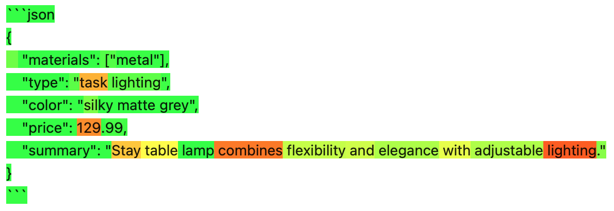

.. _library-openai:

OpenAI
======

OpenAI_ provides a client library for calling Large Language Models (LLMs).

.. _OpenAI: https://github.com/openai/openai-python

eli5 supports :func:`eli5.explain_prediction` for
``ChatCompletion``, ``ChoiceLogprobs`` and ``openai.Client`` objects,
highlighting tokens proportionally to the log probability,
which can help to see where model is less confident in it's predictions.
More likely tokens are highlighted in green,
while unlikely tokens are highlighted in red:

Explaining with a client, invoking the model with ``logprobs`` enabled:
::

    import eli5
    import opeanai
    client = openai.Client()
    prompt = 'some string'  # or [{"role": "user", "content": "some string"}]
    explanation = eli5.explain_prediction(client, prompt, model='gpt-4o')
    explanation

You may pass any extra keyword arguments to :func:`eli5.explain_prediction`,
they would be passed to the ``client.chat.completions.create``,
e.g. you may pass ``n=2`` to get multiple responses
and see explanations for each of them.

You'd normally want to run it in a Jupyter notebook to see the explanation
formatted as HTML.

You can access the ``Choice`` object on the ``explanation.targets[0].target``:
::

    explanation.targets[0].target.message.content

If you have already obtained a chat completion with ``logprobs`` from OpenAI client,
you may call :func:`eli5.explain_prediction` with
``ChatCompletion`` or ``ChoiceLogprobs`` like this:
::

    chat_completion = client.chat.completions.create(
        messages=[{"role": "user", "content": prompt}],
        model="gpt-4o",
        logprobs=True,
    )
    eli5.explain_prediction(chat_completion)  # or
    eli5.explain_prediction(chat_completion.choices[0].logprobs)

See the :ref:`tutorial <explain-llm-logprobs-tutorial>` for a more detailed usage
example.

Consider also checking other libraries which support explaining predictions of open source LLMs:

- `optillm <https://github.com/codelion/optillm>`_, e.g. see
  `codelion/optillm#168 <https://github.com/codelion/optillm/discussions/168#discussioncomment-12399569>`_
- you can also visualize the ouputs using the
  `logprobs visualizer <https://huggingface.co/spaces/codelion/LogProbsVisualizer>`_

.. note::
    While token probabilities reflect model uncertainty in many cases,
    they are not always indicative,
    e.g. in case of `Chain of Thought <https://arxiv.org/abs/2201.11903>`_
    preceding the final response.
    See the :ref:`tutorial's limitations section <explain-llm-logprobs-tutorial>`
    for an example of that.

.. note::
    Top-level :func:`eli5.explain_prediction` calls are dispatched
    to :func:`eli5.llm.explain_prediction.explain_prediction_openai_client`
    or :func:`eli5.llm.explain_prediction.explain_prediction_openai_completion`
    or :func:`eli5.llm.explain_prediction.explain_prediction_openai_logprobs`
    .
